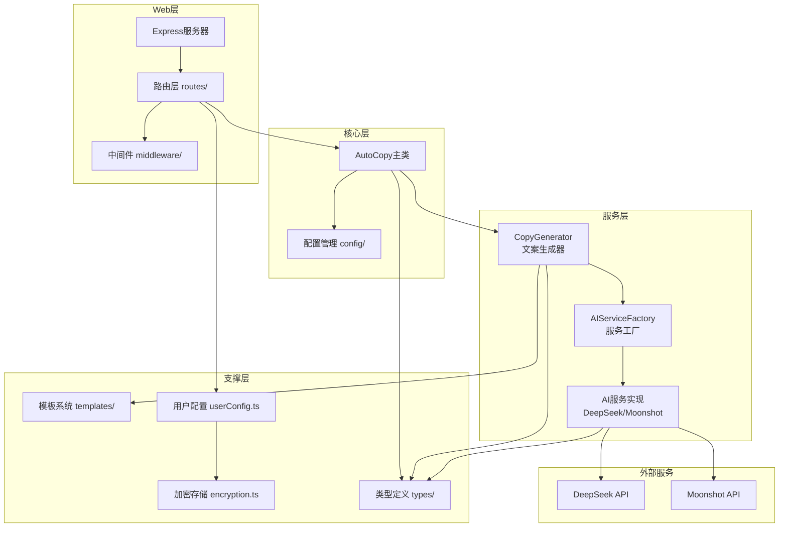

# AutoCopy

智能文案生成工具 - 基于 AI 的社交媒体文案自动生成系统

## 项目架构

基于分层架构设计，支持多模型实例配置，核心层调用 AI 服务实现文案生成。



## 目录结构

```
autocopy/
├── public/                      # 前端静态资源
│   ├── src/                     # 前端源码 (TypeScript)
│   │   ├── components/          # UI组件
│   │   │   ├── toast.ts         # Toast 提示组件
│   │   │   ├── dialog.ts        # Dialog 对话框组件
│   │   │   ├── modal.ts         # Modal 模态框组件
│   │   │   ├── button.ts        # Button 按钮组件
│   │   │   ├── form-field.ts    # FormField 表单字段组件
│   │   │   ├── auto-resize-textarea.ts  # 自适应高度文本框
│   │   │   └── index.ts         # 组件导出
│   │   ├── managers/            # 业务管理器
│   │   │   ├── provider-config.ts   # 模型配置管理
│   │   │   ├── custom-tone.ts       # 自定义语气管理
│   │   │   ├── scoring.ts           # 评分诊断管理
│   │   │   ├── prompt-preview.ts    # 提示词预览管理
│   │   │   ├── model-parameters.ts  # 模型参数管理
│   │   │   └── index.ts         # 管理器导出
│   │   ├── utils/               # 工具函数
│   │   │   ├── api.ts           # API 客户端
│   │   │   ├── logger.ts        # 日志工具
│   │   │   ├── dom.ts           # DOM 操作工具
│   │   │   ├── clipboard.ts     # 剪贴板工具
│   │   │   ├── keywords.ts      # 关键词解析工具
│   │   │   └── index.ts         # 工具导出
│   │   ├── types/               # TypeScript 类型定义
│   │   │   ├── copywriting.ts   # 文案相关类型
│   │   │   ├── provider.ts      # 模型配置类型
│   │   │   ├── scoring.ts       # 评分类型
│   │   │   ├── custom-tone.ts   # 自定义语气类型
│   │   │   └── index.ts         # 类型导出
│   │   ├── app.ts               # 应用主入口
│   │   └── tsconfig.json        # 前端 TypeScript 配置
│   ├── js/                      # 编译输出 (JavaScript)
│   ├── css/                     # 样式文件
│   │   ├── system/              # 系统样式
│   │   │   ├── variables.css    # CSS 变量
│   │   │   ├── reset.css        # 样式重置
│   │   │   ├── layout.css       # 布局样式
│   │   │   └── utilities.css    # 工具类
│   │   ├── components/          # 组件样式
│   │   │   ├── button.css
│   │   │   ├── form.css
│   │   │   ├── card.css
│   │   │   ├── toast.css
│   │   │   ├── dialog.css
│   │   │   ├── modal.css
│   │   │   ├── results.css
│   │   │   ├── scoring.css
│   │   │   └── ...
│   │   └── main.css             # 样式入口
│   ├── favicon.svg              # 网站图标 (SVG)
│   ├── favicon.ico              # 网站图标 (ICO)
│   └── index.html               # HTML 入口
│
├── src/                         # 后端源码 (TypeScript)
│   ├── config/                  # 配置模块
│   │   ├── ai-providers.ts      # AI 服务商默认配置
│   │   ├── default.ts           # 应用默认配置
│   │   └── index.ts
│   ├── services/                # 服务层
│   │   ├── ai/                  # AI 服务
│   │   │   ├── base.ts          # 基础服务类
│   │   │   ├── factory.ts       # 服务工厂
│   │   │   ├── deepseek.ts      # DeepSeek 服务
│   │   │   ├── moonshot.ts      # Moonshot (Kimi) 服务
│   │   │   ├── error-handler.ts # 错误处理
│   │   │   └── index.ts
│   │   └── generator/           # 生成器
│   │       ├── copyGenerator.ts # 文案生成器
│   │       ├── scoring.ts       # 评分系统
│   │       └── index.ts
│   ├── templates/               # 提示词模板
│   │   ├── index.ts
│   │   └── promptTemplates.ts
│   ├── types/                   # TypeScript 类型定义
│   │   ├── ai.ts
│   │   ├── copywriting.ts
│   │   └── index.ts
│   ├── utils/                   # 工具函数
│   │   ├── encryption.ts        # AES-256-GCM 加密
│   │   ├── userConfig.ts        # 用户配置存储
│   │   ├── formatter.ts         # 格式化工具
│   │   ├── cache.ts             # 缓存工具
│   │   ├── logger.ts            # 日志工具
│   │   └── index.ts
│   ├── web/                     # Web 服务
│   │   ├── routes/              # API 路由
│   │   │   ├── copywriting.ts   # 文案生成 API
│   │   │   ├── providers.ts     # 模型配置 API
│   │   │   └── index.ts
│   │   ├── middleware/          # 中间件
│   │   │   ├── cors.ts
│   │   │   ├── errorHandler.ts
│   │   │   ├── rateLimit.ts
│   │   │   ├── validation.ts
│   │   │   └── index.ts
│   │   └── server.ts            # 服务入口
│   └── index.ts                 # 主入口
│
├── data/                        # 数据目录
│   └── user-config.json         # 用户配置存储文件
│
├── docs/                        # 文档目录
│   └── encryption.md            # 加密说明文档
│
├── .github/                     # GitHub 配置
│   └── workflows/
│       └── ci.yml               # CI 配置
│
├── package.json                 # 项目配置
├── tsconfig.json                # 后端 TypeScript 配置
├── tsconfig.frontend.json       # 前端编译配置 (旧)
└── README.md                    # 项目说明
```

## 核心模块

### 前端模块

#### 组件层 (components/)

| 模块 | 说明 |
|------|------|
| toast.ts | 非交互型提示消息组件，支持 info/success/warning/error 四种类型 |
| dialog.ts | 交互型对话框组件，支持 alert/confirm 模式 |
| modal.ts | 通用模态框组件，支持自定义内容和事件 |
| button.ts | 按钮组件，支持 loading 状态和多种样式 |
| form-field.ts | 表单字段组件，支持多种输入类型 |
| auto-resize-textarea.ts | 自适应高度的文本框组件 |

#### 管理器层 (managers/)

| 模块 | 说明 |
|------|------|
| provider-config.ts | 模型配置管理，处理模型实例的增删改查 |
| custom-tone.ts | 自定义语气风格管理 |
| scoring.ts | 文案评分诊断管理 |
| prompt-preview.ts | 提示词预览和编辑管理 |
| model-parameters.ts | 模型参数配置管理 |

#### 工具层 (utils/)

| 模块 | 说明 |
|------|------|
| api.ts | 统一的 API 客户端，封装所有 HTTP 请求 |
| logger.ts | 前端日志工具，支持分级日志和持久化 |
| dom.ts | DOM 操作工具函数 |
| clipboard.ts | 剪贴板操作工具 |
| keywords.ts | 关键词解析和渲染工具 |

### 后端模块

#### 配置管理 (config/)

| 文件 | 说明 |
|------|------|
| ai-providers.ts | AI 服务商默认配置，包含模型列表、默认模型、API 地址等 |
| default.ts | 应用默认配置，服务端口、日志级别等 |

#### AI 服务 (services/ai/)

| 文件 | 说明 |
|------|------|
| base.ts | AI 服务基类，定义统一接口 `chat()`、`streamChat()` |
| factory.ts | 服务工厂，根据 provider 类型创建对应服务实例 |
| deepseek.ts | DeepSeek API 实现 |
| moonshot.ts | Moonshot (Kimi) API 实现 |
| error-handler.ts | AI 服务错误处理，统一错误类型转换 |

#### 文案生成 (services/generator/)

| 文件 | 说明 |
|------|------|
| copyGenerator.ts | 文案生成器，调用 AI 服务生成文案，处理模板渲染 |
| scoring.ts | 文案评分系统，多维度质量评估 |

#### 用户配置 (utils/userConfig.ts)

支持多模型实例配置：
- 每个模型可配置独立实例（API 密钥、参数等）
- 同一模型只能有一个实例
- 支持设置默认实例
- API 密钥 AES-256-GCM 加密存储

### API 路由 (web/routes/)

| 路由 | 方法 | 说明 |
|------|------|------|
| /api/copywriting/generate | POST | 生成文案 |
| /api/copywriting/generate-stream | POST | 流式生成文案 (SSE) |
| /api/copywriting/preview | POST | 预览提示词 |
| /api/copywriting/score | POST | 评分诊断 |
| /api/copywriting/custom-tones | GET/POST | 自定义语气管理 |
| /api/providers | GET | 获取所有模型配置 |
| /api/providers/instances | POST | 创建模型实例 |
| /api/providers/instances/:id | PUT/DELETE | 更新/删除模型实例 |
| /api/providers/instances/:id/default | POST | 设置默认实例 |
| /api/providers/instances/:id/parameters | PUT | 更新模型参数 |
| /api/providers/validate | POST | 验证 API 密钥 |

## 支持的 AI 模型

| 厂商 | 模型 | 说明 |
|------|------|------|
| DeepSeek | deepseek-chat | DeepSeek-V3.2 非思考模式 (128K上下文) |
| DeepSeek | deepseek-reasoner | DeepSeek-V3.2 思考模式 (128K上下文) |
| Moonshot (Kimi) | kimi-k2.5 | Kimi K2.5 模型 |
| Moonshot (Kimi) | kimi-k2-turbo-preview | Kimi K2 Turbo 预览版 |
| Moonshot (Kimi) | kimi-k2-0711-preview | Kimi K2 0711 预览版 |

## 开发指南

### 环境要求

- Node.js >= 18.0.0
- npm >= 9.0.0

### 安装依赖

```bash
npm install
```

### 开发模式

```bash
# 同时启动后端和前端开发服务
npm run dev:full

# 仅启动后端
npm run dev:web

# 仅编译前端
npm run dev:frontend:watch
```

### 生产构建

```bash
# 构建后端和前端
npm run build:all

# 仅构建后端
npm run build

# 仅构建前端
npm run build:frontend
```

### 启动服务

```bash
npm run web
```

服务默认运行在 http://localhost:3000

## 配置实例说明

用户可配置多个模型实例：
- 每个实例包含：API 密钥、模型选择、自定义参数
- 实例名称可选，留空则使用模型名称
- 同一模型只能配置一个实例
- 支持为每个实例单独配置温度、最大 Token 等参数

## 许可证

MIT License
