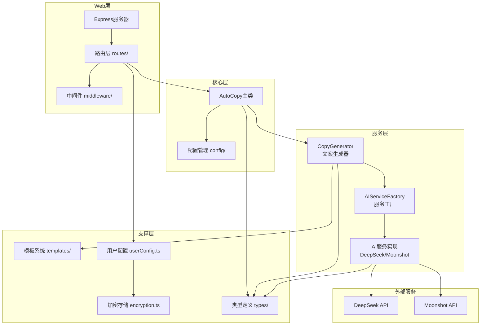

# AutoCopy

## 项目架构

基于分层架构设计，支持多模型实例配置，核心层调用 AI 服务实现文案生成。



## 目录结构

```
src/
├── config/                 # 配置模块
│   ├── ai-providers.ts     # AI服务商默认配置
│   ├── default.ts          # 应用默认配置
│   └── index.ts
├── services/               # 服务层
│   ├── ai/                 # AI服务
│   │   ├── base.ts         # 基础服务类
│   │   ├── factory.ts      # 服务工厂
│   │   ├── deepseek.ts     # DeepSeek服务
│   │   ├── moonshot.ts     # Moonshot(Kimi)服务
│   │   ├── error-handler.ts # 错误处理
│   │   └── index.ts
│   └── generator/          # 生成器
│       ├── copyGenerator.ts
│       └── index.ts
├── templates/              # 提示词模板
│   ├── index.ts
│   └── promptTemplates.ts
├── types/                  # TypeScript类型定义
│   ├── ai.ts
│   ├── copywriting.ts
│   └── index.ts
├── utils/                  # 工具函数
│   ├── encryption.ts       # AES-256-GCM加密
│   ├── userConfig.ts       # 用户配置存储
│   ├── formatter.ts        # 格式化工具
│   └── index.ts
├── web/                    # Web服务
│   ├── routes/             # API路由
│   │   ├── copywriting.ts  # 文案生成API
│   │   ├── providers.ts    # 模型配置API
│   │   └── index.ts
│   ├── middleware/         # 中间件
│   │   ├── errorHandler.ts
│   │   └── index.ts
│   └── server.ts           # 服务入口
└── index.ts                # 主入口

data/
└── user-config.json        # 用户配置存储文件
```

## 核心模块

### 配置管理 (config/)

| 文件 | 说明 |
|------|------|
| ai-providers.ts | AI 服务商默认配置，包含模型列表、默认模型、API 地址等 |
| default.ts | 应用默认配置，服务端口、日志级别等 |

### AI 服务 (services/ai/)

| 文件 | 说明 |
|------|------|
| base.ts | AI 服务基类，定义统一接口 `chat()`、`streamChat()` |
| factory.ts | 服务工厂，根据 provider 类型创建对应服务实例 |
| deepseek.ts | DeepSeek API 实现 |
| moonshot.ts | Moonshot (Kimi) API 实现 |
| error-handler.ts | AI 服务错误处理，统一错误类型转换 |

### 文案生成 (services/generator/)

| 文件 | 说明 |
|------|------|
| copyGenerator.ts | 文案生成器，调用 AI 服务生成文案，处理模板渲染 |

### 用户配置 (utils/userConfig.ts)

支持多模型实例配置：
- 每个模型可配置独立实例（API 密钥、参数等）
- 同一模型只能有一个实例
- 支持设置默认实例
- API 密钥 AES-256-GCM 加密存储

### API 路由 (web/routes/)

| 路由 | 说明 |
|------|------|
| POST /api/copywriting/generate | 生成文案 |
| POST /api/copywriting/generate/stream | 流式生成文案 |
| GET /api/providers | 获取所有模型配置 |
| POST /api/providers/instances | 创建模型实例 |
| PUT /api/providers/instances/:id | 更新模型实例 |
| DELETE /api/providers/instances/:id | 删除模型实例 |
| POST /api/providers/instances/:id/default | 设置默认实例 |
| POST /api/providers/validate | 验证 API 密钥 |

## 支持的 AI 模型

| 厂商 | 模型 | 说明 |
|------|------|------|
| DeepSeek | deepseek-chat | DeepSeek-V3.2 非思考模式 (128K上下文) |
| DeepSeek | deepseek-reasoner | DeepSeek-V3.2 思考模式 (128K上下文) |
| Moonshot (Kimi) | kimi-k2.5 | Kimi K2.5 模型 |
| Moonshot (Kimi) | kimi-k2-turbo-preview | Kimi K2 Turbo 预览版 |
| Moonshot (Kimi) | kimi-k2-0711-preview | Kimi K2 0711 预览版 |

## 配置实例说明

用户可配置多个模型实例：
- 每个实例包含：API 密钥、模型选择、自定义参数
- 实例名称可选，留空则使用模型名称
- 同一模型只能配置一个实例
- 支持为每个实例单独配置温度、最大 Token 等参数
