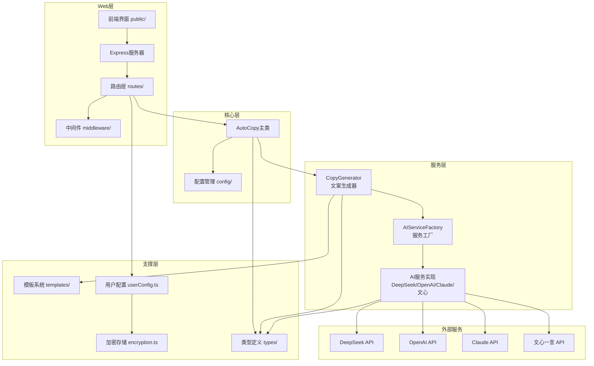

# AutoCopy

## 项目架构

基于分层架构设计，支持多模型切换，用户通过前端界面配置 API 密钥，核心层调用 AI 服务实现文案生成。



## 目录结构

```
src/
├── config/                 # 配置模块
│   ├── ai-providers.ts     # AI服务商默认配置
│   ├── default.ts          # 应用默认配置
│   └── index.ts
├── services/               # 服务层
│   ├── ai/                 # AI服务
│   │   ├── base.ts         # 基础服务类
│   │   ├── factory.ts      # 服务工厂
│   │   ├── deepseek.ts     # DeepSeek服务
│   │   ├── openai.ts       # OpenAI服务
│   │   ├── claude.ts       # Claude服务
│   │   ├── wenxin.ts       # 文心一言服务
│   │   └── error-handler.ts # 错误处理
│   └── generator/          # 生成器
│       └── copyGenerator.ts
├── templates/              # 提示词模板
├── types/                  # TypeScript类型定义
├── utils/                  # 工具函数
│   ├── encryption.ts       # AES-256-GCM加密
│   ├── userConfig.ts       # 用户配置存储
│   └── formatter.ts        # 格式化工具
├── web/                    # Web服务
│   ├── routes/             # API路由
│   │   ├── copywriting.ts  # 文案生成API
│   │   └── providers.ts    # 模型配置API
│   ├── middleware/         # 中间件
│   └── server.ts           # 服务入口
└── index.ts                # 主入口

public/
├── index.html              # 前端页面
├── css/style.css           # 样式文件
└── js/                     # 前端脚本
    ├── app.ts              # 主应用
    ├── modal.ts            # 弹窗组件
    └── providerConfig.ts   # 模型配置管理
```

## 核心功能

| 模块 | 说明 |
|------|------|
| 多模型支持 | DeepSeek、OpenAI、Claude、文心一言、通义千问、Gemini |
| 用户配置 | 前端配置 API 密钥，AES-256-GCM 加密存储 |
| 文案生成 | 支持多种文章类型、语气风格、关键词设置 |
| 弹窗组件 | 统一的 Modal 组件，替代原生 alert/confirm |
